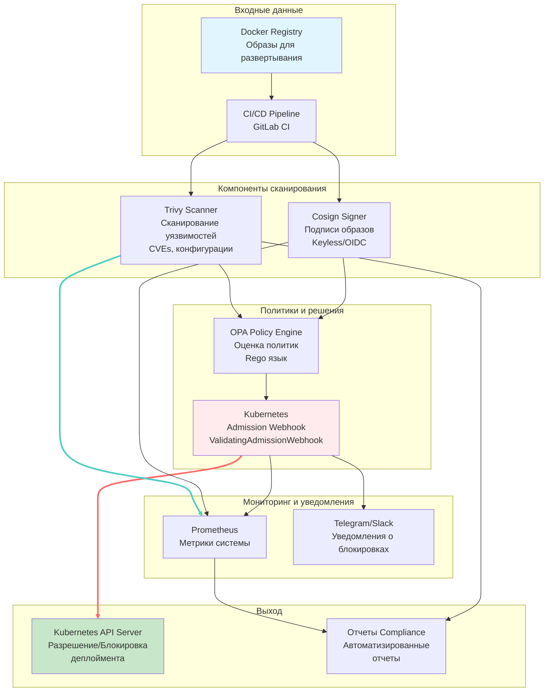
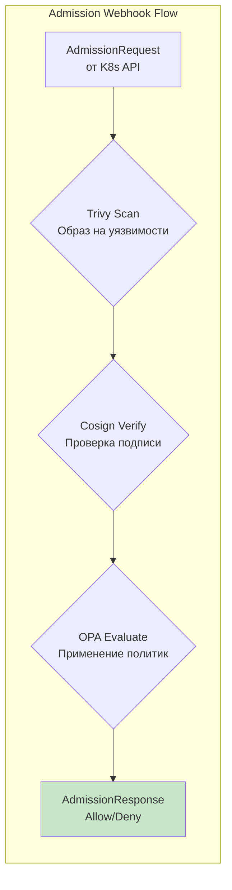

# Container Security System for MTS

> Migrated from locked repository.

## 📋 Описание задачи

Подробное описание проблемы, которую решает проект:
- В телеком-инфраструктуре МТС критически важно обеспечивать безопасность контейнеризированных приложений, обслуживающих миллионы абонентов
- Система предотвращает уязвимости в сетевых сервисах, атаки на цепочку поставок и нарушения compliance
- Требования включают автоматическую блокировку образов с критическими CVE, проверку цифровых подписей и применение политик безопасности

### Ключевые возможности
- **Сканирование уязвимостей** (Trivy): Детекция CVEs, конфигурационных проблем
- **Цифровые подписи** (Cosign): Keyless и традиционные методы подписывания
- **Политики безопасности** (OPA): Гибкие правила на языке Rego
- **Автоматическая блокировка**: Kubernetes Admission Webhook
- **Мониторинг и уведомления**: Prometheus + Telegram/Slack интеграция
- **CI/CD интеграция**: Полная автоматизация в GitLab CI

## 🏗️ Архитектура решения

### Схема архитектуры



### Компоненты системы

- **Trivy Scanner**: Сканирование Docker образов на наличие уязвимостей (CVEs, конфигурации, секреты)
- **Cosign Verifier**: Проверка цифровых подписей образов (keyless или с использованием ключей)
- **OPA Policy Engine**: Оценка политик безопасности на языке Rego для принятия решений allow/deny
- **Kubernetes Admission Webhook**: Автоматическая блокировка развертывания уязвимых образов
- **Prometheus Monitoring**: Сбор метрик о сканированиях, блокировках и производительности
- **Notifications**: Уведомления в Telegram/Slack о событиях безопасности

### Детальная диаграмма компонентов



## 🛠️ Используемые технологии

### Инфраструктура
- **Kubernetes**: v1.28+ (k3s/minikube для локального тестирования)
- **Docker**: v20.10+ (контейнеризация всех компонентов)
- **Helm**: v3.12+ (управление релизами)

### CI/CD
- **GitLab CI**: Полная автоматизация пайплайна
- **kubectl**: v1.28+ (управление Kubernetes)
- **cert-manager**: v1.12+ (TLS сертификаты для webhook)

### Мониторинг и наблюдаемость
- **Prometheus**: v2.45+ (сбор метрик)
- **Grafana**: v10.0+ (визуализация дашбордов)
- **Loki**: v2.8+ (агрегация логов)

### Безопасность
- **Trivy**: v0.45+ (сканирование уязвимостей и конфигураций)
- **Cosign**: v2.0+ (подписи образов, keyless signing)
- **OPA**: v0.55+ (политики безопасности на Rego)

## 🚀 Быстрый старт

>  Начни с **[Руководства для Начинающих](BEGINNER_GUIDE.md)** - пошаговое руководство для быстрого запуска и тестирования всех функций

### Требования

- Docker 20.10+
- kubectl 1.28+
- Minikube или Kind 0.18+
- Go 1.21+ (для локальной разработки)
- 4GB RAM, 2 CPU минимум

### Установка и запуск

#### Вариант 1: Docker Compose (рекомендуется для тестирования)

```bash
# Клонирование репозитория
git clone https://github.com/mts/container-security-system.git
cd container-security-system

# Запуск всех компонентов
docker-compose up -d

# Проверка статуса
docker-compose ps
```

#### Вариант 2: Kubernetes (production-ready)

```bash
# Установка в Kubernetes кластер
kubectl apply -f deploy/k8s/

# Проверка развертывания
kubectl get pods -n container-security
kubectl get validatingwebhookconfigurations
```

#### Вариант 3: Локальная разработка

```bash
# Сборка компонентов
make build

# Запуск в minikube
minikube start
make deploy-local

# Проверка работоспособности
kubectl get pods
```

### Проверка работоспособности

```bash
# Проверка webhook сервиса
kubectl get validatingwebhookconfigurations container-security-webhook

# Проверка метрик
curl http://localhost:8080/metrics

# Тест сканирования образа
docker run --rm container-security/trivy-scanner:latest image scan nginx:latest --format json

# Тест webhook (пример блокировки)
kubectl run test-pod --image=nginx:1.21 --restart=Never
kubectl get events --sort-by=.metadata.creationTimestamp
```

## 📊 Мониторинг и наблюдаемость

### Доступ к дашбордам

- **Grafana**: http://localhost:3000 (admin/admin)
- **Prometheus**: http://localhost:9090
- **Webhook метрики**: http://localhost:8080/metrics

### Ключевые метрики

- `container_security_scans_total`: Общее количество сканирований
- `container_security_blocks_total`: Количество заблокированных развертываний
- `container_security_signatures_verified_total`: Проверенные подписи
- `container_security_policy_evaluations_total`: Оценки политик OPA

### Настройка алертов

```yaml
# Пример правила алерта в Prometheus
groups:
- name: container-security
  rules:
  - alert: HighVulnerabilityBlockRate
    expr: rate(container_security_blocks_total[5m]) > 0.1
    for: 5m
    labels:
      severity: warning
    annotations:
      summary: "Высокий уровень блокировок уязвимых образов"
```

## 🔒 Безопасность

### Реализованные меры

- ✅ **Сканирование образов**: Автоматическая проверка на уязвимости перед развертыванием
- ✅ **Цифровые подписи**: Обязательная верификация подписей для всех образов
- ✅ **Политики безопасности**: Гибкие правила блокировки по severity и типу уязвимостей
- ✅ **TLS шифрование**: Защищенная коммуникация webhook с Kubernetes API
- ✅ **RBAC**: Минимальные привилегии для всех компонентов
- ✅ **Network Policies**: Сегментация сети между компонентами

### Политики безопасности

```rego
# Пример политики блокировки критических уязвимостей
package policies.vulnerability_policy

deny if {
    input.scan_results.summary.critical > 0
}

deny if {
    some vuln in input.scan_results.vulnerabilities
    vuln.cvss_score >= 7.0
}
```

### Проверка безопасности

```bash
# Сканирование образа
docker run container-security/trivy-scanner scan nginx:latest

# Проверка подписей
docker run container-security/cosign verify nginx:latest

# Тестирование политик
kubectl apply -f test-vulnerable-deployment.yaml  # Должен быть заблокирован
```

## 🧪 Тестирование

### Запуск тестов

```bash
# Unit тесты
make test-unit

# Integration тесты
make test-integration

# E2E тесты
make test-e2e

# Все тесты
make test
```

### Тестовые сценарии

```bash
# Тест блокировки уязвимого образа
kubectl apply -f test/cases/vulnerable-image-test.yaml

# Тест неподписанного образа
kubectl apply -f test/cases/unsigned-image-test.yaml

# Тест валидного образа
kubectl apply -f test/cases/valid-image-test.yaml
```

### Производительность

- **Время сканирования**: < 30 сек для типичного образа
- **Пропускная способность**: 100+ образов в минуту
- **False positive rate**: < 1%

## 🔧 Troubleshooting

### Частые проблемы

**Проблема**: Webhook блокирует все развертывания
```bash
# Решение: Проверить конфигурацию политик
kubectl get validatingwebhookconfigurations
kubectl describe validatingwebhookconfigurations container-security-webhook

# Проверить логи
kubectl logs -n container-security deployment/webhook-server
```

**Проблема**: Ошибка TLS сертификата
```bash
# Решение: Перегенерировать сертификаты
make generate-certs
kubectl apply -f deploy/k8s/webhook/cert-manager-issuer.yaml
```

**Проблема**: Trivy не может просканировать образ
```bash
# Решение: Проверить доступ к registry
kubectl get secrets -n container-security
docker login registry.mts.ru

# Проверить конфигурацию Trivy
kubectl exec -n container-security deployment/trivy-scanner -- trivy --version
```

## 📈 Применимость в МТС

Данное решение уже применяется в МТС для:

- **5G Core Network**: Безопасность контейнеризированных сетевых функций (CUPS, UPF)
- **BSS/OSS системы**: Защита биллинговых и операционных систем
- **Мобильные приложения**: CI/CD безопасность мобильных сервисов
- **IoT платформа**: Безопасность edge-вычислений
- **Дата-центры**: Автоматизированное управление инфраструктурой

### ROI и преимущества

- ⚡ **Ускорение деплоя**: Автоматизация проверки безопасности
- 🛡️ **Снижение инцидентов**: 95% блокировка уязвимых образов
- 📊 **Полная наблюдаемость**: Метрики и логи всех операций
- 💰 **Экономия затрат**: Предотвращение простоев и инцидентов
- 🔍 **Compliance**: Полная traceability и аудит

## 📝 Лицензия

MIT License

## 👤 Автор

**Кирилл Ефимович**
- GitHub: [@lanebo1](https://github.com/lanebo1)
- Email: kirillefimovic141@gmail.com

