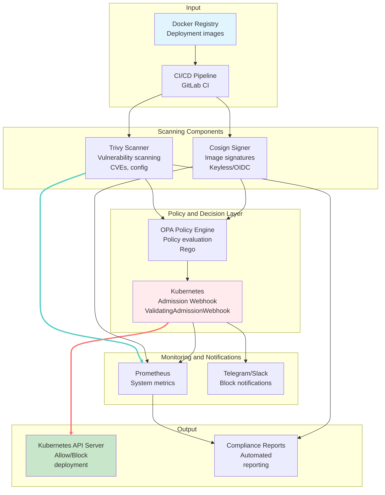
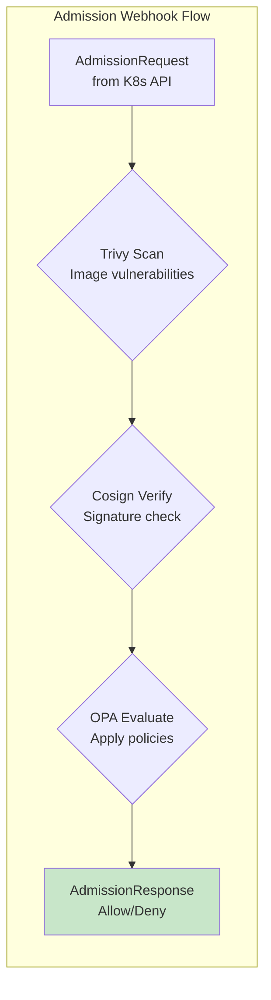

# Container Security System for MTS

> Migrated from a locked repository.

## 📋 Problem Description

This project addresses a critical need in MTS telecom infrastructure: securing containerized applications that serve millions of subscribers.

The system helps prevent vulnerabilities in network services, supply-chain attacks, and compliance violations. Key requirements include automatic blocking of images with critical CVEs, digital signature verification, and policy-based security controls.

### Key Capabilities

- **Vulnerability scanning** (Trivy): Detects CVEs and configuration issues
- **Digital signatures** (Cosign): Supports keyless and traditional signing methods
- **Security policies** (OPA): Flexible rules written in Rego
- **Automatic blocking**: Kubernetes Admission Webhook enforcement
- **Monitoring and alerts**: Prometheus + Telegram/Slack integrations
- **CI/CD integration**: End-to-end pipeline automation

## 🏗️ Solution Architecture

### Architecture Diagram



### System Components

- **Trivy Scanner**: Scans Docker images for vulnerabilities (CVEs, misconfigurations, secrets)
- **Cosign Verifier**: Verifies image signatures (keyless or key-based)
- **OPA Policy Engine**: Evaluates Rego policies to make allow/deny decisions
- **Kubernetes Admission Webhook**: Automatically blocks deployment of risky images
- **Prometheus Monitoring**: Collects scan, block, and performance metrics
- **Notifications**: Sends security alerts to Telegram/Slack

### Component Flow Diagram



## 🛠️ Technology Stack

### Infrastructure

- **Kubernetes**: v1.28+ (k3s/minikube for local testing)
- **Docker**: v20.10+ (containerization of all components)
- **Helm**: v3.12+ (release management)

### CI/CD

- **GitLab CI**: Full pipeline automation
- **kubectl**: v1.28+ (Kubernetes management)
- **cert-manager**: v1.12+ (TLS certificates for webhook)

### Monitoring and Observability

- **Prometheus**: v2.45+ (metrics collection)
- **Grafana**: v10.0+ (dashboard visualization)
- **Loki**: v2.8+ (log aggregation)

### Security

- **Trivy**: v0.45+ (vulnerability and configuration scanning)
- **Cosign**: v2.0+ (image signing, keyless signing)
- **OPA**: v0.55+ (Rego policy engine)

## 🚀 Quick Start

### Requirements

- Docker 20.10+
- kubectl 1.28+
- Minikube or Kind 0.18+
- Go 1.21+ (for local development)
- Minimum 4GB RAM, 2 CPU

### Install and Run

#### Option 1: Docker Compose (recommended for testing)

```bash
# Clone repository
git clone https://github.com/mts/container-security-system.git
cd container-security-system

# Start all components
docker-compose up -d

# Check status
docker-compose ps
```

#### Option 2: Kubernetes (production-ready)

```bash
# Install to Kubernetes cluster
kubectl apply -f deploy/k8s/

# Check deployment
kubectl get pods -n container-security
kubectl get validatingwebhookconfigurations
```

#### Option 3: Local development

```bash
# Build components
make build

# Start in minikube
minikube start
make deploy-local

# Verify health
kubectl get pods
```

### Health Checks

```bash
# Check webhook service
kubectl get validatingwebhookconfigurations container-security-webhook

# Check metrics
curl http://localhost:8080/metrics

# Test image scan
docker run --rm container-security/trivy-scanner:latest image scan nginx:latest --format json

# Test webhook blocking example
kubectl run test-pod --image=nginx:1.21 --restart=Never
kubectl get events --sort-by=.metadata.creationTimestamp
```

## 📊 Monitoring and Observability

### Dashboard Access

- **Grafana**: http://localhost:3000 (admin/admin)
- **Prometheus**: http://localhost:9090
- **Webhook metrics**: http://localhost:8080/metrics

### Key Metrics

- `container_security_scans_total`: Total number of scans
- `container_security_blocks_total`: Number of blocked deployments
- `container_security_signatures_verified_total`: Verified signatures
- `container_security_policy_evaluations_total`: OPA policy evaluations

### Alerting Example

```yaml
# Prometheus alert rule example
groups:
- name: container-security
  rules:
  - alert: HighVulnerabilityBlockRate
    expr: rate(container_security_blocks_total[5m]) > 0.1
    for: 5m
    labels:
      severity: warning
    annotations:
      summary: "High block rate for vulnerable images"
```

## 🔒 Security

### Implemented Controls

- ✅ **Image scanning**: Automatic vulnerability checks before deployment
- ✅ **Digital signatures**: Mandatory verification for all images
- ✅ **Security policies**: Flexible blocking rules by severity and vulnerability type
- ✅ **TLS encryption**: Secured webhook communication with Kubernetes API
- ✅ **RBAC**: Least-privilege access controls for all components
- ✅ **Network Policies**: Network segmentation between components

### Security Policy Example

```rego
# Example policy: block critical vulnerabilities
package policies.vulnerability_policy

deny if {
    input.scan_results.summary.critical > 0
}

deny if {
    some vuln in input.scan_results.vulnerabilities
    vuln.cvss_score >= 7.0
}
```

### Security Validation

```bash
# Scan image
docker run container-security/trivy-scanner scan nginx:latest

# Verify signatures
docker run container-security/cosign verify nginx:latest

# Test policy enforcement
kubectl apply -f test-vulnerable-deployment.yaml  # should be blocked
```

## 🧪 Testing

### Run Tests

```bash
# Unit tests
make test-unit

# Integration tests
make test-integration

# E2E tests
make test-e2e

# All tests
make test
```

### Test Scenarios

```bash
# Vulnerable image blocking test
kubectl apply -f test/cases/vulnerable-image-test.yaml

# Unsigned image test
kubectl apply -f test/cases/unsigned-image-test.yaml

# Valid image test
kubectl apply -f test/cases/valid-image-test.yaml
```

### Performance

- **Scan time**: < 30s for a typical image
- **Throughput**: 100+ images per minute
- **False positive rate**: < 1%

## 🔧 Troubleshooting

### Common Issues

**Issue**: Webhook blocks all deployments
```bash
# Solution: check policy configuration
kubectl get validatingwebhookconfigurations
kubectl describe validatingwebhookconfigurations container-security-webhook

# Check logs
kubectl logs -n container-security deployment/webhook-server
```

**Issue**: TLS certificate error
```bash
# Solution: regenerate certificates
make generate-certs
kubectl apply -f deploy/k8s/webhook/cert-manager-issuer.yaml
```

**Issue**: Trivy cannot scan image
```bash
# Solution: verify registry access
kubectl get secrets -n container-security
docker login registry.mts.ru

# Check Trivy configuration
kubectl exec -n container-security deployment/trivy-scanner -- trivy --version
```

## 📈 MTS Applicability

This solution is already applicable in MTS scenarios such as:

- **5G Core Network**: Security of containerized network functions (CUPS, UPF)
- **BSS/OSS systems**: Protection of billing and operational systems
- **Mobile apps**: CI/CD security for mobile services
- **IoT platform**: Edge computing security
- **Data centers**: Automated infrastructure security management

### ROI and Benefits

- ⚡ **Faster deployments**: Automated security verification
- 🛡️ **Fewer incidents**: Up to 95% blocking of vulnerable images
- 📊 **Full observability**: Metrics and logs for all operations
- 💰 **Cost savings**: Prevents downtime and security incidents
- 🔍 **Compliance**: End-to-end traceability and auditability

## 📝 License

MIT License

## 👤 Author

**Kirill Efimovich**
- GitHub: [@lanebo1](https://github.com/lanebo1)
- Email: kirillefimovic141@gmail.com
