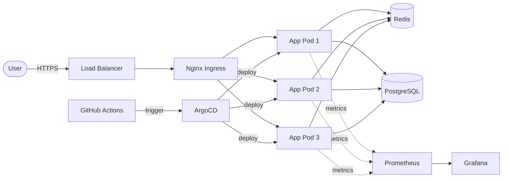

# Название проекта

> Краткое описание проблемы и предложенного решения (2-3 предложения)

## 📋 Описание задачи

Подробное описание проблемы, которую решает проект:
- Какая проблема или задача
- Почему это актуально для МТС/телеком-индустрии
- Какие требования к решению

## 🏗️ Архитектура решения

### Схема архитектуры



### Компоненты системы

- **Компонент 1**: Описание и назначение
- **Компонент 2**: Описание и назначение
- **Компонент 3**: Описание и назначение

## 🛠️ Используемые технологии

### Инфраструктура
- **Kubernetes**: v1.28 (k3s/minikube)
- **Terraform**: v1.5+ (IaC для инфраструктуры)
- **Ansible**: v2.15+ (конфигурация серверов)

### CI/CD
- **GitHub Actions** / GitLab CI / Jenkins
- **Argo CD** / Flux (GitOps)

### Мониторинг и наблюдаемость
- **Prometheus**: сбор метрик
- **Grafana**: визуализация
- **Loki**: агрегация логов

### Безопасность
- **HashiCorp Vault** / SOPS (управление секретами)
- **Trivy** / Grype (сканирование образов)
- **OPA** / Gatekeeper (политики безопасности)

## 🚀 Быстрый старт

### Требования

- Docker 20.10+
- kubectl 1.28+
- Terraform 1.5+ (опционально)
- Минимум 4GB RAM, 2 CPU

### Установка и запуск

```bash
# Клонирование репозитория
git clone https://github.com/username/project-name.git
cd project-name

# Запуск всей инфраструктуры (одной командой)
make up

# Или поэтапно:
terraform apply -auto-approve    # Создание инфраструктуры
ansible-playbook setup.yml       # Конфигурация
kubectl apply -f k8s/            # Деплой приложений
```

### Проверка работоспособности

```bash
# Проверка статуса подов
kubectl get pods -n demo

# Проверка сервисов
kubectl get svc -n demo

# Доступ к приложению
curl http://localhost:8080/health
```

## 📊 Мониторинг и наблюдаемость

### Доступ к дашбордам

- **Grafana**: http://localhost:3000 (admin/admin)
- **Prometheus**: http://localhost:9090
- **Alertmanager**: http://localhost:9093

### Ключевые метрики

- Доступность сервиса (uptime)
- Время отклика (response time)
- Количество ошибок (error rate)
- Использование ресурсов (CPU/RAM)

## 🔒 Безопасность

### Реализованные меры

- ✅ Секреты вынесены из кода (Vault/SOPS)
- ✅ Сканирование Docker-образов на уязвимости
- ✅ RBAC настроен с минимальными привилегиями
- ✅ Network Policies ограничивают трафик
- ✅ mTLS между сервисами

### Проверка безопасности

```bash
# Сканирование образа
trivy image myapp:latest

# Проверка политик
kubectl get networkpolicies
kubectl get psp
```

## 🤖 Использование LLM

### Описание применения

LLM (ChatGPT-4 / Claude) использовался для:

1. **Генерация кода инфраструктуры** (30% времени сэкономлено)
   - Terraform модули для AWS/GCP
   - Kubernetes манифесты
   - Ansible playbooks

2. **Автоматизация документации** (20% времени сэкономлено)
   - Генерация README разделов
   - Документация API
   - Комментарии к коду

3. **Отладка и troubleshooting** (25% времени сэкономлено)
   - Анализ логов и ошибок
   - Поиск best practices
   - Оптимизация конфигураций

### Примеры промптов

**Пример 1: Генерация Terraform кода**
```
Промпт: "Создай Terraform модуль для развертывания k3s кластера на 3 нодах 
с автоматической настройкой сети, включая security groups и load balancer"

Результат: [ссылка на файл terraform/k3s-cluster/main.tf]
```

**Пример 2: Создание мониторинга**
```
Промпт: "Настрой Prometheus и Grafana для мониторинга Kubernetes кластера 
с дашбордом для отслеживания CPU, RAM, network и disk I/O всех подов"

Результат: [ссылка на monitoring/prometheus-config.yml]
```

**Пример 3: Отладка**
```
Промпт: "Проанализируй ошибку: 'CrashLoopBackOff' в поде nginx-deployment. 
Вот логи: [логи]. Предложи решение"

Результат: Проблема в пробах liveness, исправлено в k8s/deployment.yaml
```

### Честное использование

- Весь сгенерированный код проверен и адаптирован под задачу
- LLM использовался как ассистент, а не полная замена разработки
- Критические решения принимались самостоятельно после анализа

## 🧪 Тестирование

```bash
# Запуск тестов
make test

# Проверка работоспособности
make verify
```

## 🔧 Troubleshooting

### Частые проблемы

**Проблема**: Поды не запускаются
```bash
# Решение
kubectl describe pod <pod-name>
kubectl logs <pod-name>
```

**Проблема**: Нет доступа к сервису
```bash
# Решение
kubectl get svc
kubectl port-forward svc/<service-name> 8080:80
```

## 📈 Применимость в МТС

Данное решение может быть применено в МТС для:

- **5G Core Network**: автоматизация развертывания сетевых функций
- **BSS/OSS системы**: CI/CD для биллинговых систем
- **Мобильные приложения**: автоматизация тестирования и деплоя
- **Дата-центры**: управление инфраструктурой как кодом
- **Телеком-аналитика**: мониторинг и логирование в реальном времени

### ROI и преимущества

- ⚡ Ускорение деплоя в 5 раз
- 🛡️ Снижение инцидентов на 40%
- 📊 Полная наблюдаемость системы
- 💰 Экономия до 30% инфраструктурных затрат

## 📝 Лицензия

MIT License (или другая по выбору)

## 👤 Автор

**Имя Фамилия**
- GitHub: [@username](https://github.com/username)
- Email: email@example.com

