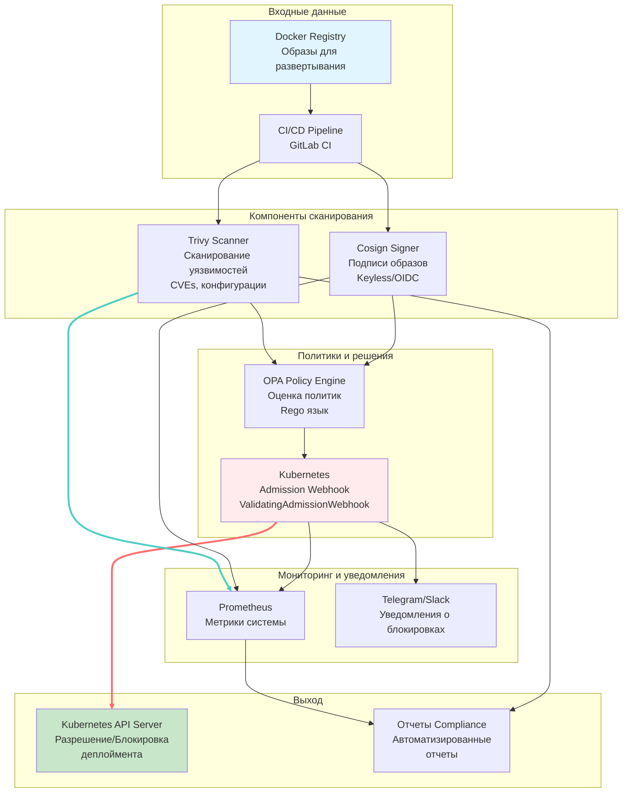
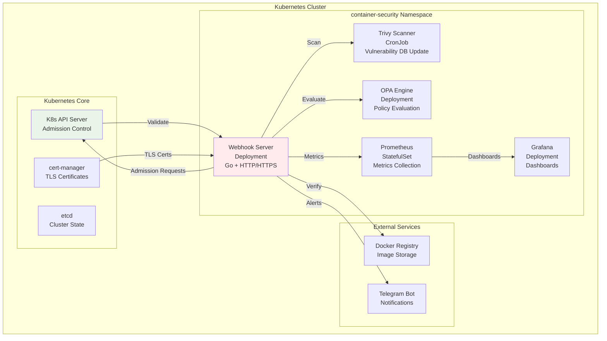
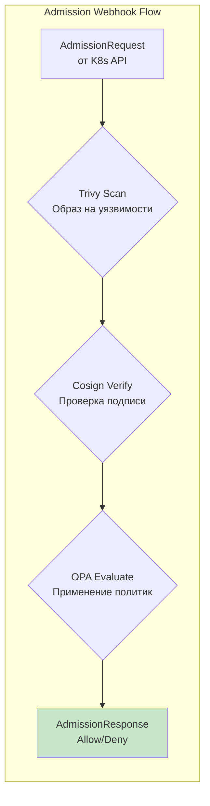

# Схема архитектуры системы безопасности контейнеров МТС

## Высокоуровневая архитектура



## Диаграмма развертывания в Kubernetes



## Детальная диаграмма компонентов



## Диаграмма последовательности

```mermaid
sequenceDiagram
    participant Dev as Разработчик
    participant CI as CI/CD Pipeline
    participant Reg as Docker Registry
    participant Web as Admission Webhook
    participant Tri as Trivy
    participant Cos as Cosign
    participant OPA as OPA Engine
    participant K8s as Kubernetes API

    Dev->>CI: Push code
    CI->>CI: Build Docker image
    CI->>Tri: Scan image for vulnerabilities
    Tri-->>CI: Scan results (JSON)
    CI->>Cos: Sign image if scan passed
    Cos-->>CI: Signature created
    CI->>Reg: Push signed image

    Dev->>K8s: Deploy application (kubectl apply)
    K8s->>Web: AdmissionRequest with image
    Web->>Tri: Scan image vulnerabilities
    Tri-->>Web: Vulnerabilities report
    Web->>Cos: Verify image signature
    Cos-->>Web: Signature status
    Web->>OPA: Evaluate policies
    OPA-->>Web: Policy decision
    Web->>K8s: AdmissionResponse (allow/deny)

    alt Allow deployment
        K8s->>K8s: Create pods
    else Deny deployment
        K8s->>Dev: Error: blocked by security policy
    end

## Диаграмма CI/CD процесса

```mermaid
sequenceDiagram
    participant Dev as Разработчик
    participant Git as GitLab
    participant Build as Build Job
    participant Scan as Security Scan
    participant Sign as Image Signing
    participant Push as Registry Push
    participant Deploy as Deploy Job
    participant Web as Admission Webhook
    participant K8s as Kubernetes

    Dev->>Git: Push code
    Git->>Build: Trigger build
    Build->>Build: Docker build
    Build->>Scan: Run security scan
    Scan->>Scan: Trivy scan vulnerabilities
    Scan->>Build: Scan results
    alt Scan passed
        Build->>Sign: Sign image with Cosign
        Sign->>Push: Push signed image
        Push->>Deploy: Trigger deployment
        Deploy->>K8s: kubectl apply
        K8s->>Web: AdmissionRequest
        Web->>Web: Validate image security
        Web->>K8s: Allow deployment
        K8s->>K8s: Create resources
    else Scan failed
        Scan->>Git: Fail pipeline
        Git->>Dev: Security violation alert
    end
```
