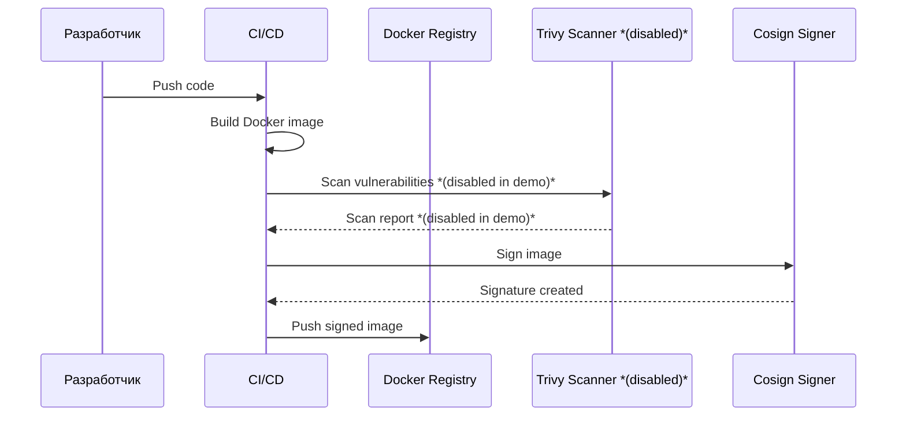
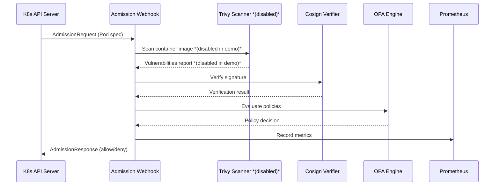

# Архитектурный флоу и общие понятия системы безопасности контейнеров МТС

## Общие понятия и терминология

### Container Security (Безопасность контейнеров)

Комплексный подход к защите контейнеризированных приложений, включающий:

- **Сканирование уязвимостей**: Поиск известных CVE в образах
- **Цифровые подписи**: Гарантия целостности и происхождения образов
- **Политики безопасности**: Правила допуска/запрета развертываний
- **Runtime защита**: Мониторинг и реагирование на угрозы

### Kubernetes Admission Control

Механизм Kubernetes для валидации и модификации запросов API:

- **ValidatingAdmissionWebhook**: Проверяет запросы и может их отклонить
- **MutatingAdmissionWebhook**: Может модифицировать объекты перед сохранением
- **AdmissionReview**: Стандартный формат для обмена данными между API Server и webhook

### Supply Chain Security (Безопасность цепочки поставок)

Защита от атак на процесс разработки и развертывания:

- **SBOM (Software Bill of Materials)**: Перечень всех компонентов
- **Provenance**: Доказательство происхождения артефактов
- **SLSA (Supply chain Levels for Software Artifacts)**: Фреймворк для оценки безопасности цепочки поставок

## Основные компоненты системы

### 1. Trivy Scanner (Сканер уязвимостей) *(отключен в демо-версии)*

**Назначение**: Сканирование контейнерных образов на наличие уязвимостей безопасности

**Ключевые возможности**:

- **OS packages**: Сканирование пакетов операционной системы
- **Application dependencies**: Проверка библиотек приложений
- **Secrets detection**: Поиск секретов в коде и конфигах
- **Configuration checks**: Валидация конфигураций (Dockerfile, Kubernetes manifests)

**Архитектура**:

REST API с эндпоинтами `/health`, `/ready`, `/api/v1/scan`

Интеграция с базой данных уязвимостей (обновляется периодически)

Кэширование результатов для оптимизации производительности

Поддержка различных форматов вывода (JSON, SARIF, table)

### 2. Cosign Verifier (Верификатор подписей)

**Назначение**: Проверка цифровых подписей контейнерных образов

**Методы подписи**:

- **Keyless signing**: Подпись через OIDC провайдеров (GitHub, Google)
- **Traditional keys**: Классические криптографические ключи
- **Certificate-based**: X.509 сертификаты с Fulcio/Rekor

**Процесс верификации**:

1. Извлечение сигнатуры из registry (`.sig` слой)
2. Проверка сертификата через Rekor transparency log
3. Валидация цепочки доверия
4. Проверка соответствия политики (identity, issuer, etc.)

### 3. OPA Policy Engine (Движок политик)

**Назначение**: Оценка политик безопасности на декларативном языке Rego

**Структура политик**:

```rego
package policies.security

# Правило разрешения
allow if {
    input.scan_results.summary.critical == 0
    input.signature_verified == true
}

# Причина блокировки
deny[{"reason": "Critical vulnerabilities found"}] if {
    input.scan_results.summary.critical > 0
}
```

**Типы политик**:

- **Vulnerability policies**: Правила по уязвимостям (CVSS score, severity)
- **Base image policies**: Одобренные базовые образы
- **Signature policies**: Требования к подписям
- **Compliance policies**: Соответствие стандартам (PCI DSS, GDPR)

### 4. Kubernetes Admission Webhook

**Назначение**: Интеграция с Kubernetes API Server для блокировки небезопасных развертываний

**Webhook flow**:

1. **AdmissionRequest** от K8s API Server
2. **Извлечение образов** из Pod specifications
3. **Параллельная обработка** образов (scan + verify)
4. **Оценка политик** через OPA
5. **AdmissionResponse** с решением allow/deny

## Архитектурный флоу системы

### Поток данных (Data Flow)

```
Docker Registry → CI/CD Pipeline → Admission Webhook → [Trivy* + Cosign + OPA] → K8s API Server *Trivy отключен в демо-версии
                              ↓
                        Prometheus Metrics
                              ↓
                        Grafana Dashboards
                              ↓
                     Telegram/Slack Alerts
```

### Детальный процесс обработки

#### Этап 1: Подготовка образа (CI/CD Pipeline)



#### Этап 2: Развертывание (Admission Control)



### Параллельная обработка образов

```mermaid
graph TD
    A[Admission Webhook] --> B{Extract images from Pod}
    B --> C[Image 1]
    B --> D[Image 2]
    B --> E[Image N]

    C --> F{Trivy Scan *(disabled)*}
    D --> G{Trivy Scan *(disabled)*}
    E --> H{Trivy Scan *(disabled)*}

    C --> I{Cosign Verify}
    D --> J{Cosign Verify}
    E --> K{Cosign Verify}

    F --> L{OPA Evaluate}
    G --> L
    H --> L
    I --> L
    J --> L
    K --> L

    L --> M{All images pass?}
    M -->|Yes| N[Allow deployment]
    M -->|No| O[Deny deployment]
```

## Контексты развертывания (Deployment Contexts)

### Environment-based policies (Политики по средам)

```yaml
# Production environment - strict policies
environment: production
policies:
  - require_signatures: true
  - max_critical_vulns: 0
  - max_high_vulns: 0
  - approved_base_images_only: true

# Staging environment - relaxed policies
environment: staging
policies:
  - require_signatures: false
  - max_critical_vulns: 0
  - max_high_vulns: 5
  - approved_base_images_only: false

# Development environment - minimal policies
environment: development
policies:
  - require_signatures: false
  - max_critical_vulns: 5
  - max_high_vulns: 20
  - approved_base_images_only: false
```

### Namespace-based routing (Маршрутизация по namespace)

```yaml
# Production namespaces
production-*, prod-*, *-prod:
  environment: production
  compliance: [pci-dss, gdpr]
  team: auto-detect

# Development namespaces
dev-*, development, *-dev:
  environment: development
  compliance: []
  team: auto-detect

# System namespaces
kube-*, default, container-security:
  environment: system
  skip_validation: true
```

## Мониторинг и наблюдаемость

### Метрики Prometheus

```prometheus
# Счетчики операций
container_security_scans_total{result="success|failed"}
container_security_signatures_verified_total{result="valid|invalid|unsigned"}
container_security_policy_evaluations_total{result="allow|deny"}

# Гистограммы производительности
container_security_scan_duration_seconds{quantile="0.5|0.95|0.99"}
container_security_webhook_request_duration_seconds{quantile="0.5|0.95|0.99"}

# Метрики блокировок
container_security_deployments_blocked_total{reason="vulnerabilities|signature|policy"}
container_security_deployments_allowed_total{namespace="...", team="..."}
```

### Логирование

```json
{
  "level": "info",
  "timestamp": "2024-01-01T12:00:00Z",
  "service": "admission-webhook",
  "request_id": "12345678-1234-1234-1234-123456789012",
  "operation": "CREATE",
  "namespace": "production",
  "pod_name": "my-app-12345",
  "images": ["registry.example.com/app:v1.2.3"],
  "decision": "DENY",
  "reason": "Image contains 2 critical vulnerabilities",
  "processing_time_ms": 1250,
  "team": "backend",
  "environment": "production"
}
```

### Уведомления

```json
{
  "event_type": "deployment_blocked",
  "severity": "CRITICAL",
  "timestamp": "2024-01-01T12:00:00Z",
  "details": {
    "namespace": "production",
    "pod_name": "compromised-app",
    "images": ["malicious-registry.com/trojan:v1.0"],
    "reason": "Image signature verification failed",
    "violations": ["unsigned_image", "untrusted_registry"],
    "recommended_action": "Review image source and sign properly"
  },
  "context": {
    "team": "frontend",
    "environment": "production",
    "compliance_required": ["pci-dss", "gdpr"]
  }
}
```

## Режимы работы системы

### 1. Strict Mode (Строгий режим)

- Все проверки обязательны
- Любое нарушение блокирует развертывание
- Максимальная безопасность

### 2. Audit Mode (Режим аудита)

- Все проверки выполняются
- Нарушения логируются, но не блокируют
- Для анализа и постепенного внедрения

### 3. Selective Mode (Выборочный режим)

- Проверки только для определенных namespace
- Labels для включения/исключения
- Гибкая конфигурация

## Масштабирование и высокая доступность

### Горизонтальное масштабирование

```yaml
apiVersion: apps/v1
kind: Deployment
metadata:
  name: container-security-webhook
spec:
  replicas: 3  # Масштабирование по нагрузке
  strategy:
    type: RollingUpdate
  template:
    spec:
      containers:
      - name: webhook
        resources:
          requests:
            cpu: 100m
            memory: 128Mi
          limits:
            cpu: 500m
            memory: 512Mi
```

### Кэширование результатов

- **Scan results cache**: Redis/Memory cache для результатов сканирования
- **Signature cache**: Кэширование верифицированных подписей
- **Policy cache**: Кэширование результатов оценки политик

### Rate limiting

- Защита от DoS атак
- Ограничение количества одновременных сканирований
- Priority queues для production deployments

## Интеграция с CI/CD

### GitLab CI Pipeline

```yaml
stages:
  - build
  - security
  - deploy

build:
  script:
    - docker build -t $CI_REGISTRY_IMAGE:$CI_COMMIT_SHA .

security_scan:
  stage: security
  script:
    - trivy image --format json $CI_REGISTRY_IMAGE:$CI_COMMIT_SHA > scan-results.json
    - cosign sign $CI_REGISTRY_IMAGE:$CI_COMMIT_SHA
  artifacts:
    reports:
      container_scanning: scan-results.json

deploy:
  stage: deploy
  script:
    - kubectl apply -f deployment.yaml
  environment: production
```

### Полная автоматизация

1. **Build**: Сборка образа
2. **Scan**: Параллельное сканирование и подпись
3. **Validate**: Локальная проверка политик
4. **Push**: Загрузка в registry только после успешных проверок
5. **Deploy**: Автоматическое развертывание с admission control

## Обработка ошибок и resilience

### Circuit Breaker Pattern

```go
// Псевдокод для circuit breaker
func (wh *WebhookHandler) validateImage(image string) error {
    scanner := wh.getScanner()

    // Circuit breaker для Trivy
    if scanner.isCircuitOpen() {
        return wh.fallbackValidation(image)
    }

    result, err := scanner.Scan(image)
    if err != nil {
        scanner.recordFailure()
        if scanner.shouldOpenCircuit() {
            wh.notifyCircuitOpen("trivy")
        }
        return wh.fallbackValidation(image)
    }

    scanner.recordSuccess()
    return nil
}
```

### Graceful Degradation

- **Trivy unavailable**: Продолжить с signature verification и policies
- **Cosign unavailable**: Продолжить с vulnerability scan и policies
- **OPA unavailable**: Использовать локальную оценку политик
- **Metrics unavailable**: Продолжить работу без сбора метрик

### Retry и timeout стратегии

- **Exponential backoff** для внешних вызовов
- **Context timeouts** для предотвращения зависаний
- **Cancel contexts** для graceful shutdown
- **Retry budgets** для предотвращения каскадных сбоев

## Заключение

Система безопасности контейнеров МТС представляет собой комплексное решение с многоуровневой архитектурой, обеспечивающее:

- **Многослойную защиту**: Сканирование + подписи + политики
- **Высокую производительность**: Параллельная обработка и кэширование
- **Масштабируемость**: Горизонтальное масштабирование и resilience
- **Наблюдаемость**: Полный мониторинг и alerting
- **Гибкость**: Адаптация под разные среды и требования compliance

Архитектура построена на принципах **zero-trust**, **defense-in-depth** и **shift-left security**, обеспечивая безопасность на всех этапах жизненного цикла контейнерных приложений.
